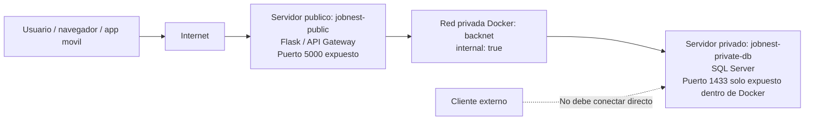

# Evidencias ED Semana 1 - JobNest

## 1. Arquitectura publico/privado



### Archivos relevantes

- `docker-compose.ed.yml`
- `Dockerfile.ed`
- `.env.example`

### Prueba sugerida

Levantar arquitectura:

```bash
docker compose --env-file .env -f docker-compose.ed.yml up -d --build
```

Si el build tarda demasiado, verifica que exista `.dockerignore`. Este entregable excluye `frontend/`, `JobNestMovil/`, `node_modules/`, `.git/` y archivos `.zip` para que Docker no mande cientos de MB al contexto.

Ver contenedores:

```bash
docker compose --env-file .env -f docker-compose.ed.yml ps
```

Comprobar que solo el servidor publico tiene puerto publicado:

```bash
docker ps --format "table {{.Names}}\t{{.Ports}}"
```


> Nota: si tambien tienes un SQL Server local de desarrollo con `0.0.0.0:1433->1433/tcp`, ese contenedor no es la arquitectura final del entregable. Para la evidencia ED usa los contenedores `jobnest-public` y `jobnest-private-db` creados por `docker-compose.ed.yml`.

Evidencia esperada:

- `jobnest-public` muestra `0.0.0.0:5000->5000/tcp`.
- `jobnest-private-db` no muestra `0.0.0.0:1433->1433/tcp`.

## 2. Hashing de contrasenas con Argon2

El proyecto usa Argon2 mediante `passlib`.

Puntos de codigo:

- Registro: `hash_password(password)`
- Login: `verificar_password(hash_guardado, password)`
- Cambio de contrasena: `hash_password(nueva_contrasena)`

Query de evidencia:

```sql
SELECT TOP 10 id, Email, PasswordHash
FROM Usuarios
ORDER BY id DESC;

-- Desde terminal si usas SQL Server local:
-- sqlcmd -S localhost,1433 -U SA -P 'TU_PASSWORD' -d JobNest -C -Q "SELECT TOP 10 id, Email, PasswordHash FROM Usuarios ORDER BY id DESC;"
```


Si `sqlcmd -S localhost,1433` falla pero Docker muestra SQL Server activo, puedes ejecutar la consulta desde dentro del contenedor. Primero identifica el nombre:

```bash
docker ps --format "table {{.Names}}\t{{.Ports}}"
```

Luego usa el nombre del contenedor SQL:

```bash
docker exec NOMBRE_CONTENEDOR_SQL /opt/mssql-tools18/bin/sqlcmd -S localhost -U SA -P 'TU_PASSWORD' -d JobNest -C -Q "SELECT TOP 10 id, Email, PasswordHash FROM Usuarios ORDER BY id DESC;"
```

Resultado esperado:

```text
$argon2id$v=19$m=...
```

La contrasena real nunca debe verse en la tabla.

## 3. Prueba de login

En Postman:

- Metodo: `POST`
- URL local: `http://127.0.0.1:5000/login`
- Body: `x-www-form-urlencoded`

Campos:

```text
email=correo@prueba.com
password=TuPassword123!
```

Resultado esperado:

```json
{
  "success": true
}
```

## 4. Encriptado en reposo

Campos sensibles definidos para JobNest:

- `Personas.Telefono`
- `Mensajes.Cuerpo`
- `SolicitudesServicios.MensajeCliente`
- `Pagos.ProcesadorChargeId`

Todos se guardan con prefijo:

```text
enc:v1:
```

Queries de evidencia:

```sql
SELECT TOP 10 UsuarioId, Telefono
FROM Personas
WHERE Telefono IS NOT NULL
ORDER BY id DESC;

-- Desde terminal si usas SQL Server local:
-- sqlcmd -S localhost,1433 -U SA -P 'TU_PASSWORD' -d JobNest -C -Q "SELECT TOP 10 UsuarioId, Telefono FROM Personas WHERE Telefono IS NOT NULL ORDER BY id DESC;"

SELECT TOP 10 id, Cuerpo
FROM Mensajes
ORDER BY id DESC;

SELECT TOP 10 id, MensajeCliente
FROM SolicitudesServicios
WHERE MensajeCliente IS NOT NULL
ORDER BY id DESC;

SELECT TOP 10 id, ProcesadorChargeId
FROM Pagos
WHERE ProcesadorChargeId IS NOT NULL
ORDER BY id DESC;
```

Resultado esperado:

```text
enc:v1:gAAAAA...
```

## 5. Generar llave de cifrado

Ejecutar una sola vez y copiar el resultado a `.env` como `DATA_ENCRYPTION_KEY`:

```bash
python3 -c "from cryptography.fernet import Fernet; print(Fernet.generate_key().decode())"
```

Regla: la llave nunca debe subirse al repositorio.

## 6. Migracion de base de datos

Antes de probar cifrado, ejecutar:

```sql
-- archivo: seguridad_semana1.sql
```

Esto amplía los campos sensibles para que puedan guardar texto cifrado.
