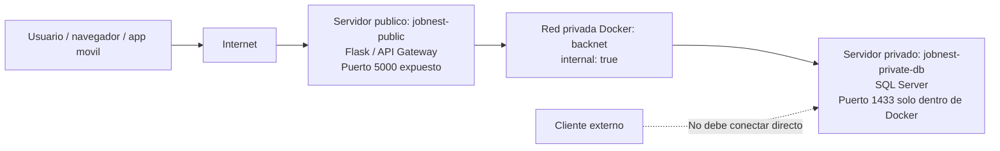
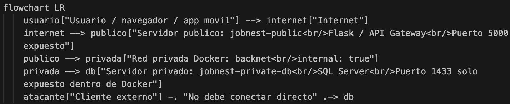
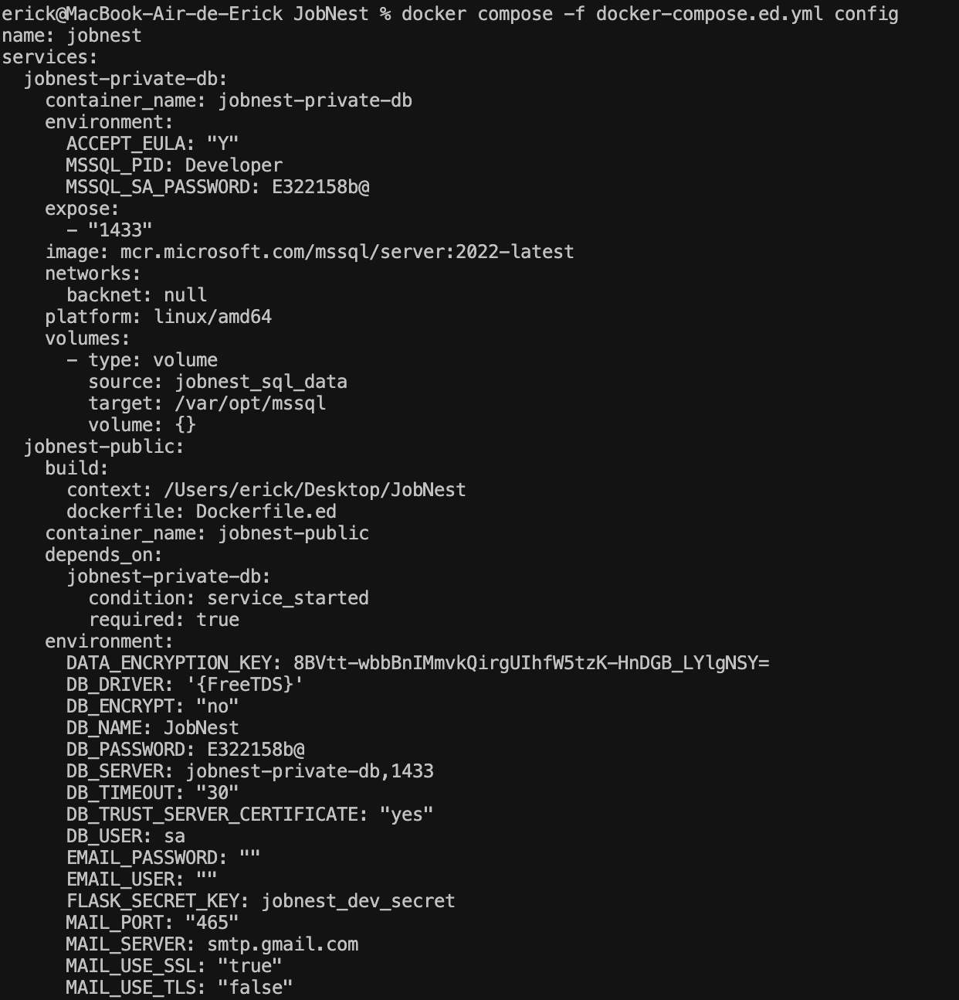
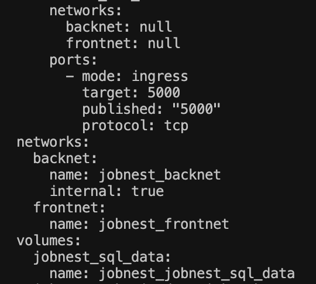
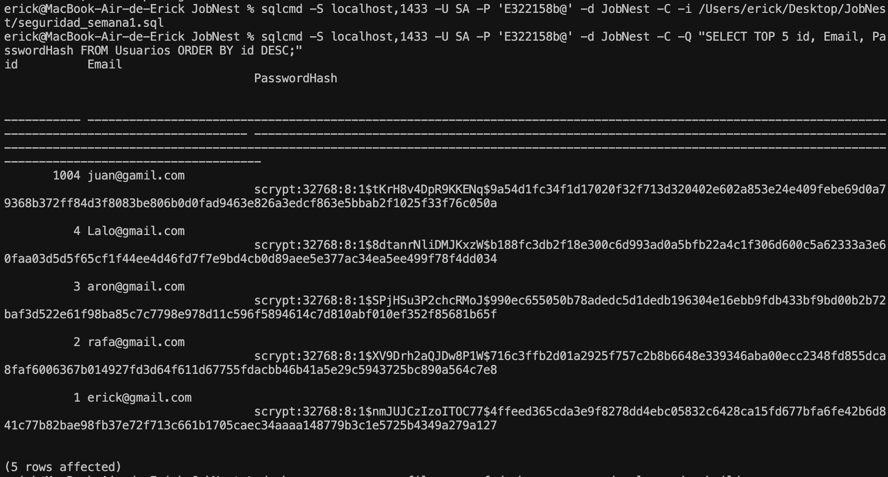
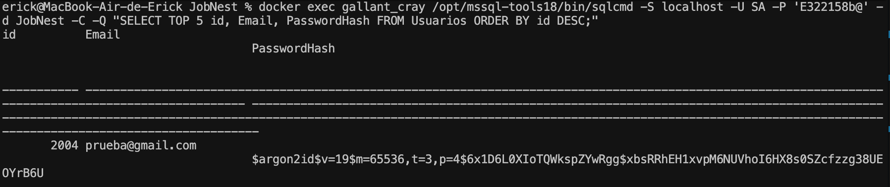
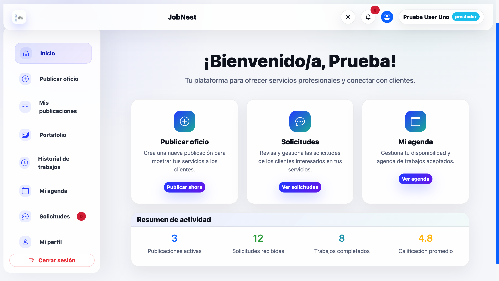
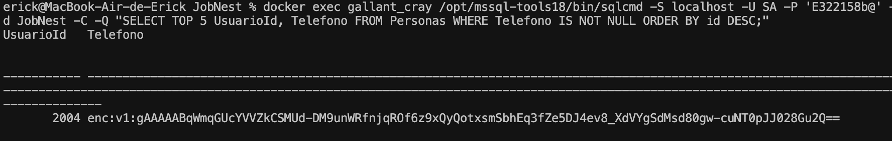

# Reporte ED - Semana 1

## Proyecto

**JobNest**

## Tema

Separación de servidor público y privado, hashing de contraseñas y encriptado de datos sensibles en reposo.

## Objetivo

Implementar medidas iniciales de seguridad para separar la parte pública del sistema de la parte privada, evitar el almacenamiento de contraseñas en texto plano y proteger datos sensibles almacenados en la base de datos.

---

## 1. Definición de parte pública y privada

En JobNest se identificaron dos zonas principales:

### Parte pública

La parte pública corresponde al servidor que recibe las peticiones del usuario desde el navegador o la aplicación:

- Frontend web.
- Backend Flask expuesto como API / servidor público.
- Puerto público configurado: `5000`.
- Servicio Docker: `jobnest-public`.

Este servidor es el único que debe recibir tráfico externo.

### Parte privada

La parte privada corresponde a los componentes que no deben estar expuestos directamente a internet:

- Base de datos SQL Server.
- Datos de usuarios.
- Contraseñas hasheadas.
- Datos personales cifrados.
- Lógica interna de persistencia.

Servicio Docker: `jobnest-private-db`.

La base de datos solo expone el puerto `1433` dentro de la red privada de Docker, pero no publica ese puerto hacia internet.

---

## 2. Arquitectura propuesta

La arquitectura separa el servidor público del servidor privado usando Docker Compose. El servidor público se conecta a dos redes:

- `frontnet`: red pública donde se expone el servidor web.
- `backnet`: red interna para comunicarse con la base de datos.

La base de datos únicamente pertenece a `backnet`, la cual está marcada como `internal: true`.



### Evidencia







En la evidencia se observa:

- `jobnest-public` publica el puerto `5000`.
- `jobnest-private-db` solo usa `expose: 1433`, sin `ports`.
- La red `backnet` aparece con `internal: true`.

> Nota de seguridad: la captura de configuración muestra variables sensibles como contraseña y llave de cifrado. Para entregar formalmente, se recomienda ocultar esos valores antes de compartir el documento.

---

## 3. Hashing de contraseñas

Se implementó hashing de contraseñas utilizando **Argon2**, evitando almacenar contraseñas en texto plano.

### Implementación

En el backend se implementaron funciones para:

- Generar hash con Argon2 al registrar usuarios nuevos.
- Verificar contraseñas durante el inicio de sesión.
- Migrar hashes antiguos a Argon2 cuando un usuario inicia sesión correctamente.

Esto permite que usuarios antiguos con hash previo puedan seguir iniciando sesión, mientras que los nuevos usuarios ya se almacenan con Argon2.

### Evidencia de hashes anteriores

En la siguiente captura se observan usuarios antiguos con hashes tipo `scrypt`. Estos no son texto plano, pero corresponden al método anterior.



### Evidencia de usuario nuevo con Argon2

Después de registrar un nuevo usuario, la base de datos muestra el campo `PasswordHash` con formato:

```text
$argon2id$...
```

Esto confirma que la contraseña no se guarda en texto plano.



### Evidencia de login funcionando

El usuario registrado pudo iniciar sesión correctamente en JobNest.



---

## 4. Encriptado de datos sensibles en reposo

Además de las contraseñas, se identificaron datos personales y sensibles que deben protegerse en reposo.

### Datos protegidos

Se aplicó cifrado a campos sensibles como:

- Teléfono del usuario.
- Cuerpo de mensajes.
- Mensajes de solicitudes de servicio.
- Identificadores sensibles de pagos.

Para estos campos se utiliza cifrado simétrico mediante una llave almacenada en variable de entorno. La llave no debe guardarse directamente en el código ni subirse al repositorio.

### Evidencia de teléfono cifrado

En la base de datos el teléfono aparece con prefijo:

```text
enc:v1:
```

Esto indica que el dato está cifrado en reposo y no se almacena como número legible.



---

## 5. Pruebas realizadas

### Prueba 1: ejecución de script de seguridad

Se ejecutó el script:

```bash
sqlcmd -S localhost,1433 -U SA -P '********' -d JobNest -C -i /Users/erick/Desktop/JobNest/seguridad_semana1.sql
```

Este script ajusta columnas sensibles para permitir almacenar datos cifrados.

### Prueba 2: verificación de hashes

Se consultó la tabla `Usuarios`:

```sql
SELECT TOP 5 id, Email, PasswordHash
FROM Usuarios
ORDER BY id DESC;
```

Resultado esperado:

- El campo `PasswordHash` no contiene la contraseña real.
- Los usuarios nuevos muestran hash con prefijo `$argon2id$`.

### Prueba 3: verificación de datos cifrados

Se consultó la tabla `Personas`:

```sql
SELECT TOP 5 UsuarioId, Telefono
FROM Personas
WHERE Telefono IS NOT NULL
ORDER BY id DESC;
```

Resultado esperado:

- El teléfono no aparece en texto plano.
- El valor aparece cifrado con prefijo `enc:v1:`.

### Prueba 4: revisión de arquitectura Docker

Se ejecutó:

```bash
docker compose -f docker-compose.ed.yml config
```

Resultado esperado:

- El servicio público expone puerto `5000`.
- La base de datos privada no publica puerto externo.
- La red `backnet` está marcada como interna.

---

## 6. Conclusión

Con los cambios realizados, JobNest cumple con los puntos solicitados para la Semana 1:

- Se definió qué parte del sistema es pública y cuál es privada.
- Se separó la arquitectura mediante servicios y redes Docker.
- El servidor privado no queda expuesto directamente hacia internet en la configuración propuesta.
- Las contraseñas nuevas se almacenan con hash Argon2.
- La contraseña nunca se guarda en texto plano.
- Se identificaron datos sensibles adicionales y se cifraron en reposo.
- Se generaron evidencias mediante consola, base de datos y funcionamiento del sistema.

La implementación mejora la seguridad inicial del proyecto y deja una base más sólida para futuras fases de despliegue.

